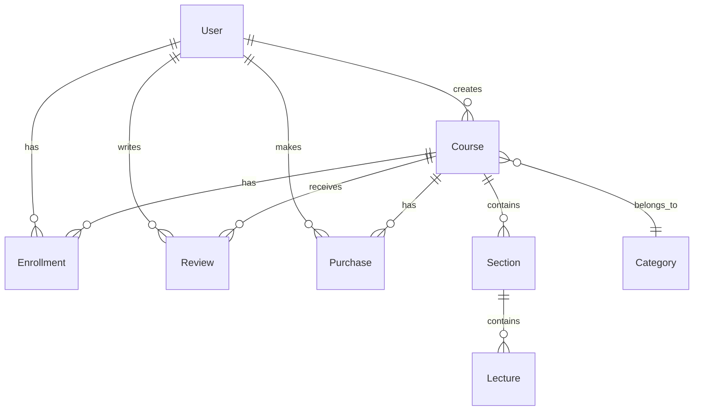

# Database Schema

Learnify uses PostgreSQL with Prisma ORM.

## Entity Relationship Diagram



## Models

### User

The central user model with role-based access.

```prisma
model User {
  id             String    @id @default(cuid())
  name           String?
  email          String    @unique
  emailVerified  DateTime?
  password       String?
  image          String?
  role           UserRole  @default(STUDENT)
  bio            String?

  // Relations
  courses        Course[]     // Courses created (instructor)
  enrollments    Enrollment[] // Enrolled courses (student)
  reviews        Review[]
  purchases      Purchase[]

  createdAt      DateTime  @default(now())
  updatedAt      DateTime  @updatedAt
}

enum UserRole {
  STUDENT
  INSTRUCTOR
  ADMIN
}
```

### Course

Courses created by instructors.

```prisma
model Course {
  id          String       @id @default(cuid())
  title       String
  slug        String       @unique
  description String?
  imageUrl    String?
  price       Float        @default(0)
  level       CourseLevel  @default(BEGINNER)
  status      CourseStatus @default(DRAFT)

  // Relations
  instructor   User        @relation(fields: [instructorId])
  instructorId String
  category     Category?   @relation(fields: [categoryId])
  categoryId   String?
  sections     Section[]
  enrollments  Enrollment[]
  reviews      Review[]
  purchases    Purchase[]

  createdAt    DateTime    @default(now())
  updatedAt    DateTime    @updatedAt
}

enum CourseLevel {
  BEGINNER
  INTERMEDIATE
  ADVANCED
}

enum CourseStatus {
  DRAFT
  PENDING
  PUBLISHED
  REJECTED
}
```

### Section & Lecture

Course content organization.

```prisma
model Section {
  id        String    @id @default(cuid())
  title     String
  position  Int       @default(0)

  course    Course    @relation(fields: [courseId])
  courseId  String
  lectures  Lecture[]

  createdAt DateTime  @default(now())
  updatedAt DateTime  @updatedAt
}

model Lecture {
  id          String      @id @default(cuid())
  title       String
  description String?
  videoUrl    String?
  duration    Int?        // In seconds
  position    Int         @default(0)
  isFree      Boolean     @default(false)
  type        LectureType @default(VIDEO)

  section     Section     @relation(fields: [sectionId])
  sectionId   String

  createdAt   DateTime    @default(now())
  updatedAt   DateTime    @updatedAt
}

enum LectureType {
  VIDEO
  TEXT
  QUIZ
}
```

### Enrollment & Progress

Student enrollment and progress tracking.

```prisma
model Enrollment {
  id          String   @id @default(cuid())
  progress    Float    @default(0)
  completedAt DateTime?

  user        User     @relation(fields: [userId])
  userId      String
  course      Course   @relation(fields: [courseId])
  courseId    String

  createdAt   DateTime @default(now())
  updatedAt   DateTime @updatedAt

  @@unique([userId, courseId])
}
```

### Purchase

Payment records for course purchases.

```prisma
model Purchase {
  id              String         @id @default(cuid())
  amount          Float
  status          PurchaseStatus @default(PENDING)
  stripePaymentId String?        @unique

  user            User           @relation(fields: [userId])
  userId          String
  course          Course         @relation(fields: [courseId])
  courseId        String

  createdAt       DateTime       @default(now())
  updatedAt       DateTime       @updatedAt
}

enum PurchaseStatus {
  PENDING
  COMPLETED
  REFUNDED
}
```

### Category

Course categorization.

```prisma
model Category {
  id      String   @id @default(cuid())
  name    String   @unique
  slug    String   @unique
  courses Course[]

  createdAt DateTime @default(now())
  updatedAt DateTime @updatedAt
}
```

### Review

Student reviews and ratings.

```prisma
model Review {
  id       String  @id @default(cuid())
  rating   Int     // 1-5
  comment  String?

  user     User    @relation(fields: [userId])
  userId   String
  course   Course  @relation(fields: [courseId])
  courseId String

  createdAt DateTime @default(now())
  updatedAt DateTime @updatedAt

  @@unique([userId, courseId])
}
```

## Database Commands

```bash
# Generate Prisma Client
npx prisma generate

# Push schema to database
npm run db:push

# Seed database
npm run db:seed

# Open Prisma Studio
npm run db:studio

# Reset database
npx prisma db push --force-reset
```
