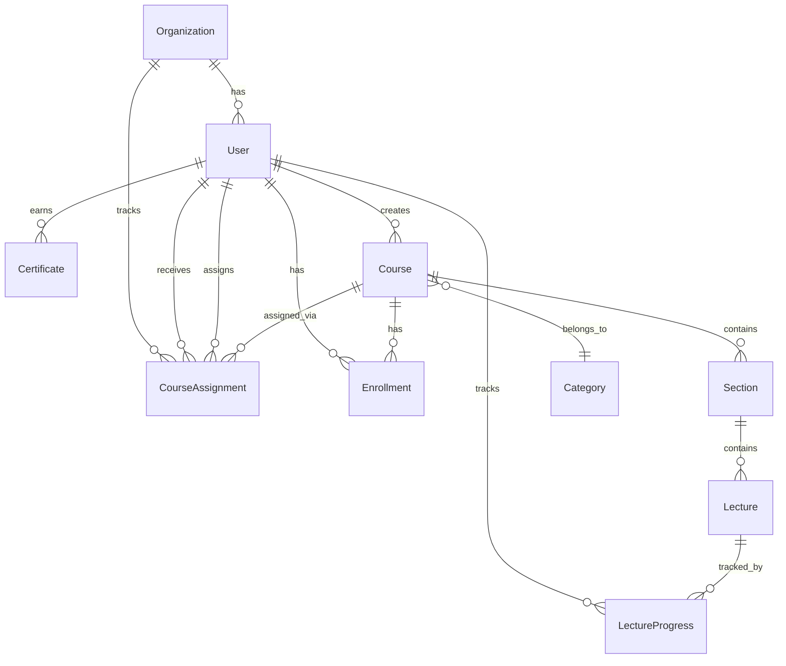

# Database Schema

Learnify Childcare uses PostgreSQL with Prisma ORM. The database is hosted on Neon in production.

## Entity Relationship Diagram



## Enums

```prisma
enum UserRole {
  LEARNER
  CORPORATE_ADMIN
  SUPER_ADMIN
}

enum CourseLevel {
  BEGINNER
  INTERMEDIATE
  ADVANCED
  ALL_LEVELS
}

enum CourseStatus {
  DRAFT
  PUBLISHED
  ARCHIVED
}

enum LectureType {
  VIDEO
  TEXT
  QUIZ
}

enum AssignmentStatus {
  ASSIGNED
  IN_PROGRESS
  COMPLETED
  OVERDUE
}
```

## Models

### User

The central user model representing learners, corporate admins, and super admins. Users belong to an organisation (except super admins).

```prisma
model User {
  id            String    @id @default(cuid())
  email         String    @unique
  emailVerified DateTime?
  password      String?
  name          String?
  image         String?
  bio           String?   @db.Text
  role          UserRole  @default(LEARNER)

  jobTitle String?
  staffId  String?

  organizationId String?
  organization   Organization? @relation(fields: [organizationId], references: [id])

  createdAt DateTime @default(now())
  updatedAt DateTime @updatedAt

  // Auth relations
  accounts Account[]
  sessions Session[]

  // Learning relations
  enrollments  Enrollment[]
  progress     LectureProgress[]
  certificates Certificate[]

  // Course creation (SUPER_ADMIN)
  createdCourses Course[]

  // Assignments
  assignments  CourseAssignment[]              // Courses assigned to this learner
  assignedByMe CourseAssignment[] @relation("AssignedBy")  // Courses this admin assigned

  @@index([email])
  @@index([role])
  @@index([organizationId])
}
```

**Key fields:**

| Field | Description |
|-------|-------------|
| `role` | LEARNER, CORPORATE_ADMIN, or SUPER_ADMIN |
| `organizationId` | Which childcare centre the user belongs to (null for SUPER_ADMIN) |
| `jobTitle` | Role at the childcare centre (e.g., "Lead Teacher") |
| `staffId` | Organisation-issued staff identifier |

### Organization

Represents a childcare centre. Contains billing configuration and learner limits.

```prisma
model Organization {
  id             String  @id @default(cuid())
  name           String
  slug           String  @unique
  contactName    String?
  contactEmail   String?
  phone          String?
  address        String? @db.Text
  licenseNumber  String?
  maxLearners    Int     @default(50)
  billingEnabled Boolean @default(false)
  stripeCustomerId String? @unique

  createdAt DateTime @default(now())
  updatedAt DateTime @updatedAt

  users       User[]
  assignments CourseAssignment[]

  @@index([slug])
}
```

**Key fields:**

| Field | Description |
|-------|-------------|
| `slug` | URL-safe unique identifier |
| `licenseNumber` | ECDA or government-issued childcare licence |
| `maxLearners` | Cap on learner accounts (default: 50) |
| `billingEnabled` | Whether Stripe billing is required for course assignments |
| `stripeCustomerId` | Linked Stripe customer for billing |

### Course

Training courses created by Super Admins. Uses SGD pricing and includes CPD points and SCORM metadata.

```prisma
model Course {
  id          String  @id @default(cuid())
  title       String
  slug        String  @unique
  subtitle    String?
  description String? @db.Text

  thumbnail String?

  priceSgd       Decimal @default(60) @db.Decimal(10, 2)
  cpdPoints      Int     @default(0)
  estimatedHours Decimal @default(2) @db.Decimal(4, 1)
  scormVersion   String  @default("2.0")

  level    CourseLevel @default(ALL_LEVELS)
  language String      @default("English")

  learningOutcomes String[]

  status      CourseStatus @default(DRAFT)
  publishedAt DateTime?

  totalDuration Int @default(0)
  totalLectures Int @default(0)

  createdAt DateTime @default(now())
  updatedAt DateTime @updatedAt

  createdById String
  createdBy   User @relation(fields: [createdById], references: [id])

  categoryId String
  category   Category @relation(fields: [categoryId], references: [id])

  sections    Section[]
  enrollments Enrollment[]
  assignments CourseAssignment[]

  @@index([slug])
  @@index([createdById])
  @@index([categoryId])
  @@index([status])
}
```

**Key fields:**

| Field | Description |
|-------|-------------|
| `priceSgd` | Price in SGD per assignment (default: 60.00) |
| `cpdPoints` | CPD points awarded on completion |
| `estimatedHours` | Expected time to complete |
| `scormVersion` | SCORM compatibility version (default: "2.0") |
| `status` | DRAFT, PUBLISHED, or ARCHIVED |
| `learningOutcomes` | Array of learning outcome strings |

### Category

Course categorisation for early childhood education topics.

```prisma
model Category {
  id          String  @id @default(cuid())
  name        String  @unique
  slug        String  @unique
  description String?
  icon        String?

  createdAt DateTime @default(now())
  updatedAt DateTime @updatedAt

  courses Course[]

  @@index([slug])
}
```

Default categories: Child Development, Health & Safety, Nutrition & Wellness, Curriculum Planning, Special Needs, Parent Communication, Regulatory Compliance.

### Section and Lecture

Course content organisation. Sections contain lectures. Both support drag-and-drop reordering via position field.

```prisma
model Section {
  id          String  @id @default(cuid())
  title       String
  description String?
  position    Int

  createdAt DateTime @default(now())
  updatedAt DateTime @updatedAt

  courseId String
  course  Course @relation(fields: [courseId], references: [id], onDelete: Cascade)

  lectures Lecture[]

  @@index([courseId])
  @@index([position])
}

model Lecture {
  id          String      @id @default(cuid())
  title       String
  description String?     @db.Text
  type        LectureType @default(VIDEO)
  position    Int

  videoUrl      String?
  videoDuration Int?
  videoPublicId String?   // Cloudinary public ID for video management

  content String? @db.Text  // Quiz JSON or rich text content

  createdAt DateTime @default(now())
  updatedAt DateTime @updatedAt

  sectionId String
  section   Section @relation(fields: [sectionId], references: [id], onDelete: Cascade)

  progress LectureProgress[]

  @@index([sectionId])
  @@index([position])
}
```

**Lecture types:**

| Type | Description |
|------|-------------|
| `VIDEO` | Video content uploaded via Cloudinary |
| `TEXT` | Rich text content (HTML) |
| `QUIZ` | Quiz stored as JSON in the `content` field |

### CourseAssignment

Tracks when a corporate admin assigns a course to a learner. This is the central workflow model.

```prisma
model CourseAssignment {
  id              String           @id @default(cuid())
  deadline        DateTime?
  status          AssignmentStatus @default(ASSIGNED)
  assignedAt      DateTime         @default(now())
  notes           String?          @db.Text
  stripeSessionId String?

  learnerId String
  learner   User @relation(fields: [learnerId], references: [id], onDelete: Cascade)

  courseId String
  course  Course @relation(fields: [courseId], references: [id], onDelete: Cascade)

  assignedById String
  assignedBy   User @relation("AssignedBy", fields: [assignedById], references: [id])

  organizationId String
  organization   Organization @relation(fields: [organizationId], references: [id])

  createdAt DateTime @default(now())
  updatedAt DateTime @updatedAt

  @@unique([learnerId, courseId])
  @@index([learnerId])
  @@index([courseId])
  @@index([organizationId])
  @@index([status])
}
```

**Key fields:**

| Field | Description |
|-------|-------------|
| `learnerId` | The learner who receives the assignment |
| `assignedById` | The corporate admin who created the assignment |
| `organizationId` | The organisation context (auto-set from corporate admin's org) |
| `deadline` | Optional completion deadline |
| `status` | ASSIGNED, IN_PROGRESS, COMPLETED, or OVERDUE |
| `stripeSessionId` | Stripe checkout session ID (when billing is enabled) |
| `notes` | Optional notes from the corporate admin |

**Unique constraint:** `@@unique([learnerId, courseId])` ensures each learner is assigned a course at most once.

### Enrollment and LectureProgress

Tracks learner progress through courses with SCORM-compatible data fields.

```prisma
model Enrollment {
  id String @id @default(cuid())

  progress       Int       @default(0)    // Percentage 0-100
  completedAt    DateTime?
  lastAccessedAt DateTime?

  assignedById String?
  assignedAt   DateTime?
  deadline     DateTime?

  // SCORM fields
  scormStatus      String   @default("not attempted")
  scormScore       Decimal? @db.Decimal(5, 2)
  scormTotalTime   String?
  scormSuspendData String?  @db.Text

  createdAt DateTime @default(now())
  updatedAt DateTime @updatedAt

  userId  String
  user    User   @relation(fields: [userId], references: [id], onDelete: Cascade)

  courseId String
  course  Course @relation(fields: [courseId], references: [id], onDelete: Cascade)

  @@unique([userId, courseId])
  @@index([userId])
  @@index([courseId])
}

model LectureProgress {
  id              String  @id @default(cuid())
  isCompleted     Boolean @default(false)
  watchedDuration Int     @default(0)
  lastPosition    Int     @default(0)    // Video resume position in seconds

  // SCORM fields
  scormLessonStatus   String?
  scormSessionTime    String?
  scormLessonLocation String?
  scormSuspendData    String?  @db.Text

  completedAt DateTime?
  createdAt   DateTime  @default(now())
  updatedAt   DateTime  @updatedAt

  userId    String
  user      User   @relation(fields: [userId], references: [id], onDelete: Cascade)

  lectureId String
  lecture   Lecture @relation(fields: [lectureId], references: [id], onDelete: Cascade)

  @@unique([userId, lectureId])
  @@index([userId])
  @@index([lectureId])
}
```

**SCORM fields at the enrollment level:**

| Field | Description |
|-------|-------------|
| `scormStatus` | Overall course status: "not attempted", "incomplete", "completed", "passed", "failed" |
| `scormScore` | Aggregate score (0-100) |
| `scormTotalTime` | Cumulative time in ISO 8601 duration format |
| `scormSuspendData` | Serialised state for course-level resume |

**SCORM fields at the lecture level:**

| Field | Description |
|-------|-------------|
| `scormLessonStatus` | Per-lesson status |
| `scormSessionTime` | Time spent in the current session |
| `scormLessonLocation` | Bookmark for resuming within a lecture |
| `scormSuspendData` | Per-lesson serialised state |

### Certificate

Completion certificates with CPD points and organisation context.

```prisma
model Certificate {
  id            String   @id @default(cuid())
  certificateId String   @unique
  issuedAt      DateTime @default(now())

  courseName       String
  organizationName String?
  cpdPoints        Int       @default(0)
  expiresAt        DateTime?

  userId  String
  user    User @relation(fields: [userId], references: [id], onDelete: Cascade)
  courseId String

  @@index([userId])
  @@index([certificateId])
}
```

**Key fields:**

| Field | Description |
|-------|-------------|
| `certificateId` | Unique human-readable identifier for verification (e.g., "CERT-2026-ABC123") |
| `courseName` | Denormalised course name (preserved even if course is later archived) |
| `organizationName` | Learner's organisation at time of completion |
| `cpdPoints` | CPD points awarded (denormalised from course) |
| `expiresAt` | Optional expiry date for time-limited certifications |

### Auth Models

NextAuth.js v5 adapter models for OAuth and session management.

```prisma
model Account {
  id                String  @id @default(cuid())
  userId            String
  type              String
  provider          String
  providerAccountId String
  refresh_token     String? @db.Text
  access_token      String? @db.Text
  expires_at        Int?
  token_type        String?
  scope             String?
  id_token          String? @db.Text
  session_state     String?

  user User @relation(fields: [userId], references: [id], onDelete: Cascade)

  @@unique([provider, providerAccountId])
  @@index([userId])
}

model Session {
  id           String   @id @default(cuid())
  sessionToken String   @unique
  userId       String
  expires      DateTime
  user         User @relation(fields: [userId], references: [id], onDelete: Cascade)

  @@index([userId])
}

model VerificationToken {
  identifier String
  token      String @unique
  expires    DateTime

  @@unique([identifier, token])
}

model PasswordResetToken {
  id        String   @id @default(cuid())
  email     String
  token     String   @unique
  expires   DateTime
  createdAt DateTime @default(now())

  @@index([email])
}
```

## Database Commands

```bash
# Generate Prisma Client
npx prisma generate

# Push schema to database (no migration history)
npm run db:push

# Run migrations (creates migration history)
npm run db:migrate

# Seed database with sample data
npm run db:seed

# Open Prisma Studio (browser-based DB GUI)
npm run db:studio

# Reset database (destructive)
npx prisma db push --force-reset
```

## Indexes

The schema uses strategic indexes for query performance:

| Table | Index | Purpose |
|-------|-------|---------|
| User | `email` | Login lookups |
| User | `role` | Role-based queries |
| User | `organizationId` | Organisation-scoped queries |
| Organization | `slug` | URL-based lookups |
| Course | `slug`, `status`, `categoryId`, `createdById` | Course listing and filtering |
| Section | `courseId`, `position` | Ordered section retrieval |
| Lecture | `sectionId`, `position` | Ordered lecture retrieval |
| Enrollment | `userId`, `courseId` | Progress lookups |
| LectureProgress | `userId`, `lectureId` | Per-lecture progress lookups |
| CourseAssignment | `learnerId`, `courseId`, `organizationId`, `status` | Assignment queries and filtering |
| Certificate | `userId`, `certificateId` | Certificate lookups |

## Unique Constraints

| Constraint | Purpose |
|------------|---------|
| `Enrollment(userId, courseId)` | One enrollment per learner per course |
| `LectureProgress(userId, lectureId)` | One progress record per learner per lecture |
| `CourseAssignment(learnerId, courseId)` | One assignment per learner per course |
| `Organization.slug` | Unique organisation slugs for URLs |
| `Course.slug` | Unique course slugs for URLs |
| `User.email` | Unique email addresses |
| `Certificate.certificateId` | Unique certificate IDs for verification |
