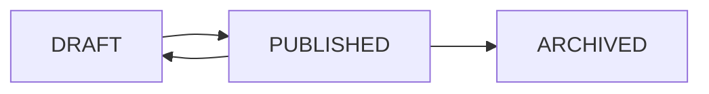
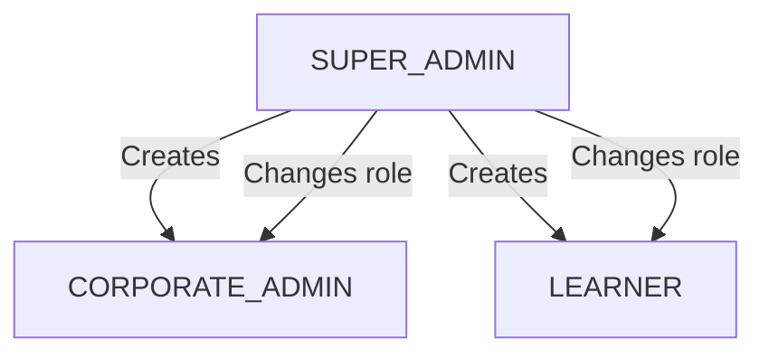

# Super Admin Features

Super Admins have full control over the Learnify Childcare platform. They create and manage courses, configure organisations, and oversee all users across the system.

## Admin Dashboard (`/admin`)

The admin dashboard provides a platform-wide overview:

- **Total users** across all organisations and roles
- **Total organisations** (childcare centres) on the platform
- **Total courses** with status breakdown (Draft, Published, Archived)
- **Total enrollments** and active assignments across the platform
- **Recent activity** feed showing new registrations, course completions, and assignments

## Course Management (`/admin/courses`)

Super Admins are the only role that can create, edit, and publish courses on the platform. Courses are designed for the early childhood education sector in Singapore.

### Creating a Course

To create a new course:

1. Navigate to `/admin/courses` and click the create button
2. Enter the course title and select a category
3. A DRAFT course is created, and you are redirected to the course editor

### Course Editor

The course editor provides a structured workflow for building complete training courses:

**Course Details**

- **Title** -- Course name visible to learners and corporate admins
- **Subtitle** -- Short summary (120 character limit)
- **Description** -- Detailed course description with rich text formatting (TipTap editor)
- **Category** -- One of the seven childcare-specific categories
- **Level** -- Beginner, Intermediate, Advanced, or All Levels
- **Language** -- Course language (default: English)
- **Thumbnail** -- Course image uploaded via Cloudinary
- **Estimated hours** -- Expected time to complete the course
- **CPD points** -- Continuing Professional Development points awarded upon completion
- **SCORM version** -- SCORM compatibility version (default: 2.0)

**Learning Outcomes**

- Define what learners will achieve after completing the course
- Editable list of outcome statements

**Curriculum (Sections and Lectures)**

- Create sections to organise course content
- Add lectures within each section
- Drag-and-drop reordering for sections and lectures (powered by dnd-kit)
- Three lecture types supported:
    - **VIDEO** -- Upload videos via Cloudinary with automatic transcoding
    - **TEXT** -- Rich text content
    - **QUIZ** -- Multiple choice, multiple select, and open-ended questions

**Pricing**

- Fixed price of SGD 60 per assignment (configured at the platform level)
- `priceSgd` field on the Course model

### Course Lifecycle

| Status | Description |
|--------|-------------|
| **DRAFT** | Course is being created or has been unpublished |
| **PUBLISHED** | Live and available for assignment by corporate admins |
| **ARCHIVED** | Retired from active use but retained for records |

### Publishing a Course

1. Fill in all required course details (title, description, category, at least one section with lectures)
2. Set CPD points and estimated hours
3. Click **Publish** to make the course available for assignment
4. Published courses appear in the course catalogue that corporate admins use to assign courses

### Course Categories

Super Admins manage the seven childcare-specific categories:

| Category | Typical Course Topics |
|----------|----------------------|
| **Child Development** | Developmental milestones, play-based learning, cognitive development |
| **Health & Safety** | CPR certification, first aid, workplace safety, infection control |
| **Nutrition & Wellness** | Meal planning, food allergies, healthy eating habits |
| **Curriculum Planning** | Lesson planning, NEL framework, activity design |
| **Special Needs** | Inclusive education, early intervention, developmental screening |
| **Parent Communication** | Parent-teacher communication, progress reporting, engagement |
| **Regulatory Compliance** | ECDA licensing, child protection, legal requirements |

## Organisation Management (`/admin/organizations`)

Super Admins create and configure organisations representing childcare centres.

### Creating an Organisation

Each organisation record includes:

| Field | Description |
|-------|-------------|
| **Name** | Organisation name (e.g., "Sunshine Childcare Centre") |
| **Slug** | URL-safe identifier (auto-generated, unique) |
| **Contact name** | Primary contact person |
| **Contact email** | Organisation email address |
| **Phone** | Contact phone number |
| **Address** | Physical address of the childcare centre |
| **License number** | ECDA or government-issued licence number |
| **Max learners** | Maximum number of learner accounts (default: 50) |
| **Billing enabled** | Whether Stripe billing is required for course assignments |
| **Stripe customer ID** | Linked Stripe customer for billing (auto-created when billing is enabled) |

### Organisation Settings

Super Admins can configure per-organisation settings:

- **Billing toggle** -- Enable or disable Stripe billing for the organisation
- **Learner cap** -- Set the maximum number of learners
- **Contact details** -- Update contact name, email, phone, and address
- **License number** -- Record the childcare centre's licence for compliance

### Viewing Organisation Details

The organisation detail view shows:

- Organisation information and settings
- List of all users (corporate admins and learners) in the organisation
- Total assignments and completion statistics
- Billing status and history (if billing is enabled)

## User Management (`/admin/users`)

Super Admins manage all users on the platform.

### User Overview

The user management page displays all users with:

- Name, email, and role
- Organisation membership
- Job title and staff ID
- Account creation date
- Actions (edit, change role)

### Role Management

Three roles are available:

| Role | Description | Access |
|------|-------------|--------|
| **LEARNER** | Childcare workers who complete assigned training | Learner dashboard, my courses, certificates |
| **CORPORATE_ADMIN** | Centre managers who assign and monitor training | Organisation dashboard, learner management, assignments, progress |
| **SUPER_ADMIN** | Platform administrators with full access | Admin dashboard, courses, organisations, users |

### User Actions

| Action | Description |
|--------|-------------|
| **View** | See user details, organisation, and activity |
| **Edit** | Update user information (name, email, job title, staff ID) |
| **Change role** | Assign or change user role |
| **Set organisation** | Assign user to an organisation |
| **Disable** | Temporarily disable a user account |

### Adding Users to Organisations

When creating or editing a user, Super Admins can:

- Assign the user to an organisation
- Set their role (LEARNER or CORPORATE_ADMIN)
- Set job title and staff ID
- The user inherits the organisation's context for all scoped operations

## Platform Configuration

Super Admins configure platform-wide settings:

- **Course pricing** -- Fixed SGD 60 per assignment (stored as `priceSgd` on Course model)
- **SCORM version** -- Default SCORM version for new courses (2.0)
- **Category management** -- Create, edit, or archive course categories
- **System health** -- Monitor database connections and service status
