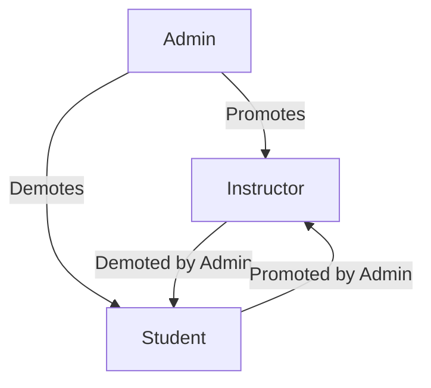

# Administrator Features

Administrators have full control over the Learnify platform.

## Dashboard Overview

The admin dashboard provides a bird's-eye view of the platform:

- Total users, courses, and enrollments
- Revenue metrics
- Recent activity feed
- Quick actions

## User Management

### User Overview

Manage all platform users:

| Action | Description |
|--------|-------------|
| View | See user details and activity |
| Edit | Update user information |
| Role Change | Assign/revoke roles |
| Suspend | Temporarily disable account |
| Delete | Remove user account |

### Role Management

Roles:

- **Student** - Default role, can browse and enroll
- **Instructor** - Can create and manage courses
- **Admin** - Full platform access

## Course Management

### Course Approval

> **Note:** The publish flow is currently simplified — instructors publish directly from DRAFT → PUBLISHED without a review step. The admin role focuses on moderation and featuring rather than pre-publish approval.

### Course Moderation

Admins can:

- Feature courses on homepage
- Unpublish inappropriate content
- Edit course details if needed
- View course analytics

## Category Management

Organize courses with categories:

- Create new categories
- Edit category names and descriptions
- Reorder categories
- Delete unused categories

## Revenue & Analytics

### Platform Revenue

Track financial metrics:

- Total revenue
- Revenue by time period
- Top-earning courses
- Payment processor fees

### Platform Analytics

Comprehensive platform metrics:

- User growth trends
- Course creation rates
- Enrollment statistics
- Completion rates
- User retention

## Instructor Applications (Legacy)

The primary path to becoming an instructor is now self-service:

1. **New users** register directly as instructors via the signup form on `/become-instructor`
2. **Existing students** click "Create Your Course" CTA which auto-promotes them via `POST /api/become-instructor`

The legacy admin-approval workflow is retained for backward compatibility:

- Students submit applications with headline and bio at `/become-instructor`
- Applications appear in admin dashboard at `/admin/applications`
- Admins can approve or reject with optional notes
- On approval, user role changes from STUDENT to INSTRUCTOR via `prisma.$transaction`
- Application statuses: PENDING, APPROVED, REJECTED

## Platform Settings

Configure platform-wide settings:

- Platform name and branding
- Commission rates (default 70/30 split)
- Min/max course pricing
- Platform fee percentage
