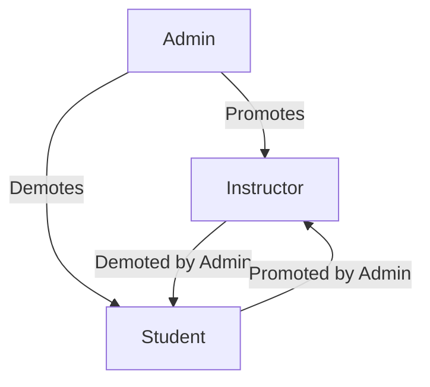

# Administrator Features

Administrators have full control over the Learnify platform.

## Dashboard Overview

The admin dashboard provides a bird's-eye view of the platform:

- Total users, courses, and enrollments
- Revenue metrics
- Recent activity feed
- Quick actions

## User Management

### User Overview

Manage all platform users:

| Action | Description |
|--------|-------------|
| View | See user details and activity |
| Edit | Update user information |
| Role Change | Assign/revoke roles |
| Suspend | Temporarily disable account |
| Delete | Remove user account |

### Role Management

Roles:

- **Student** - Default role, can browse and enroll
- **Instructor** - Can create and manage courses
- **Admin** - Full platform access

## Course Management

### Course Approval

New courses require admin approval:

1. Instructor submits course for review
2. Admin reviews course content
3. Admin approves or rejects with feedback
4. If approved, course goes live

### Course Moderation

Admins can:

- Feature courses on homepage
- Unpublish inappropriate content
- Edit course details if needed
- View course analytics

## Category Management

Organize courses with categories:

- Create new categories
- Edit category names and descriptions
- Reorder categories
- Delete unused categories

## Revenue & Analytics

### Platform Revenue

Track financial metrics:

- Total revenue
- Revenue by time period
- Top-earning courses
- Payment processor fees

### Platform Analytics

Comprehensive platform metrics:

- User growth trends
- Course creation rates
- Enrollment statistics
- Completion rates
- User retention

## Platform Settings

Configure platform-wide settings:

- Platform name and branding
- Commission rates
- Email templates
- Feature flags
