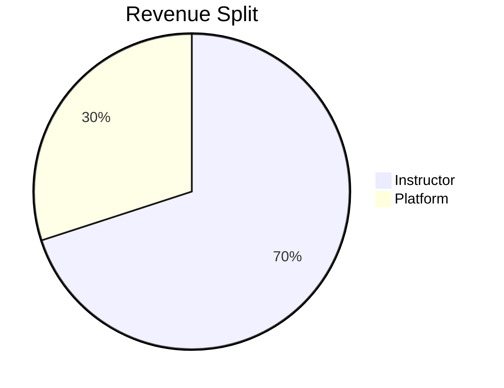

# Instructor Features

Learnify empowers instructors to create and monetize their courses.

## Becoming an Instructor

There are two paths to become an instructor (matching Udemy):

1. **New users** — Register directly as an instructor via the signup form on `/become-instructor`
2. **Existing students** — Click the "Create Your Course" CTA on `/become-instructor`, which calls `POST /api/become-instructor` to auto-promote STUDENT → INSTRUCTOR and refreshes the session

The legacy admin-approval flow (InstructorApplication model) is still in the codebase for backward compatibility but is no longer the primary path.

## Course Creation

### 3-Step Creation Wizard

New courses are created via a 3-step overlay wizard at `/instructor/courses/new`:

1. **Title** — Enter your course title
2. **Category** — Select from available categories
3. **Time commitment** — Estimate weekly hours

The wizard uses `courseCreateSchema` (title + categoryId only) to create a minimal DRAFT course, then redirects to the full course editor.

### Course Editor

The editor at `/instructor/courses/[id]` uses a left sidebar checklist (`EditorSidebar`) with three sections:

**Plan your course**

- **Intended learners** — Define learning outcomes, requirements, and target audience using Udemy-style editable rows (`EditableListField`)

**Create your content**

- **Curriculum** — Build sections and lectures with drag-and-drop reordering (dnd-kit). Supports VIDEO, TEXT, and QUIZ lecture types.

**Publish your course**

- **Course landing page** — Title, subtitle (120 char limit), description (TipTap rich text), category, level, language, thumbnail image, and promotional video
- **Pricing** — Set course price in USD (free or paid)

Each section auto-saves and calls `onSaved` to invalidate the React Query cache. Completion checkmarks are computed from course data (green CheckCircle2 icons).

### Content Types

- **Video lectures** — Uploaded via Cloudinary with automatic transcoding and adaptive streaming
- **Text content** — Rich formatting with TipTap editor (bold, italic, headings, lists)
- **Quizzes** — Multiple choice, multiple select, and open-ended questions
- **Downloadable resources** — Attached to lectures

### Pricing Options

- **Free Courses** — Build your audience
- **Paid Courses** — Monetize your expertise
- Flexible pricing in USD

## Publishing

### Simplified Publish Flow

The current publish flow is streamlined for fast iteration:

1. Fill out required sections (intended learners, curriculum, landing page)
2. Click **Publish** in the editor sidebar
3. Confirm in the dialog (warns that enrolled courses cannot be deleted)
4. Course status changes directly from DRAFT → PUBLISHED

There is no review step. To take a course offline, click **Unpublish** (sets status back to DRAFT).

### Course Status

| Status | Description |
|--------|-------------|
| Draft | Course is being created or unpublished |
| Published | Live and available for enrollment |

> **Note:** Courses with at least 1 enrolled student cannot be deleted. You can only unpublish them.

## Instructor Dashboard

The instructor area uses a collapsible sidebar (`InstructorSidebar`) that expands on hover. Available pages:

### Courses (`/instructor`)

- Udemy-style list view with course rows
- Client-side search and sort
- Quick access to edit, preview, or create courses

### Performance (`/instructor/performance`)

- Stats row showing key metrics (enrollments, revenue, ratings)
- Recharts `LineChart` showing revenue trends over time
- Date range filter for custom time periods

### Tools (`/instructor/tools`)

- Placeholder cards for future instructor tools

### Profile (`/instructor/profile`)

- Edit instructor profile (name, headline, bio)
- Social links (website, Twitter, LinkedIn)
- Profile image upload via Cloudinary

## Earnings

### Revenue Model

Instructors earn from course sales:

### Payout Tracking

- View earnings history
- Track pending payouts
- Download financial reports
