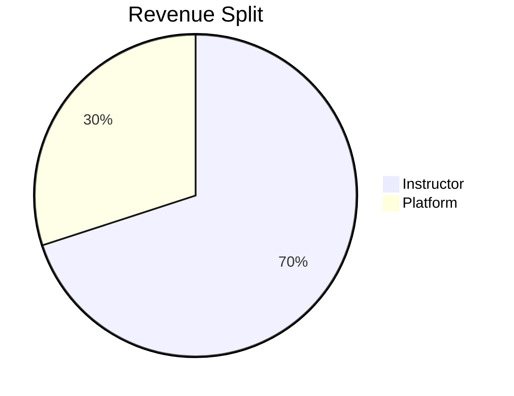

# Instructor Features

Learnify empowers instructors to create and monetize their courses.

## Course Creation

### Creating a New Course

Instructors can create rich, multimedia courses:

1. **Basic Information**
   - Course title and description
   - Category selection
   - Difficulty level
   - Thumbnail image

2. **Course Structure**
   - Organize content into sections
   - Add lectures to each section
   - Reorder with drag-and-drop

3. **Content Types**
   - Video lectures (via Cloudinary)
   - Text content with rich formatting
   - Downloadable resources

### Pricing Options

- **Free Courses** - Build your audience
- **Paid Courses** - Monetize your expertise
- Flexible pricing in USD

## Content Management

### Video Upload

Videos are uploaded directly to Cloudinary:

```
┌──────────┐     ┌───────────┐     ┌─────────────┐
│ Instructor│ --> │  Learnify │ --> │  Cloudinary │
│  Upload  │     │   Server  │     │   Storage   │
└──────────┘     └───────────┘     └─────────────┘
```

Features:

- Multiple video formats supported
- Automatic transcoding
- Adaptive streaming
- Global CDN delivery

### Course Status

| Status | Description |
|--------|-------------|
| Draft | Course is being created |
| Pending | Submitted for review |
| Published | Live and available |
| Rejected | Needs modifications |

## Analytics Dashboard

### Course Performance

Track your courses with detailed analytics:

- **Enrollments** - Total and recent
- **Revenue** - Earnings per course
- **Completion Rate** - How many students finish
- **Ratings** - Average rating and reviews

### Student Engagement

Monitor how students interact:

- Lecture completion rates
- Drop-off points
- Time spent per lecture

## Earnings

### Revenue Model

Instructors earn from course sales:



### Payout Tracking

- View earnings history
- Track pending payouts
- Download financial reports
