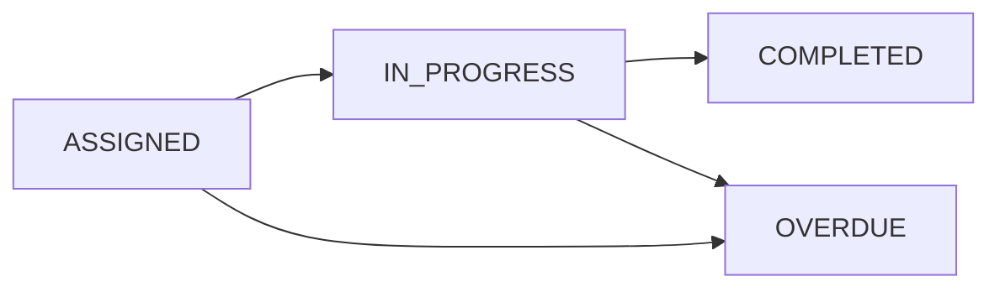

# Corporate Admin Features

Corporate Admins in Learnify Childcare are centre managers or training coordinators responsible for managing their organisation's professional development programme. They assign courses to learners, monitor progress, and ensure training compliance.

## Organisation Dashboard (`/corporate`)

The corporate admin dashboard provides an at-a-glance view of the organisation's training status:

- **Total learners** registered in the organisation
- **Active assignments** currently in progress
- **Completion rate** across all assignments
- **Overdue assignments** requiring attention
- **Recent activity** feed showing latest completions and new assignments

## Learner Management (`/corporate/learners`)

Corporate admins manage all learners within their childcare centre.

### Viewing Learners

The learner management page displays:

- List of all learners in the organisation
- Learner name, email, job title, and staff ID
- Number of assigned courses per learner
- Completion statistics per learner
- Quick links to view individual learner progress

### Organisation Scope

Corporate admins can only view and manage learners who belong to their own organisation. This data isolation is enforced at both the API and middleware levels. A corporate admin at Sunshine Childcare cannot see learners at Little Explorers, and vice versa.

### Learner Limits

Each organisation has a `maxLearners` setting (default: 50) that caps the number of learner accounts. This is configured by the Super Admin at the organisation level.

## Course Assignment (`/corporate/assign`)

The core workflow for corporate admins is assigning courses to their learners.

### Assignment Process

1. **Select a course** from the list of published courses
2. **Select a learner** from the organisation's learner list
3. **Set a deadline** (optional) for when the course must be completed
4. **Add notes** (optional) with any instructions or context for the learner
5. **Confirm the assignment** -- if billing is enabled, a Stripe checkout session is created

### Assignment Constraints

- Each learner can only be assigned a given course once (enforced by `@@unique([learnerId, courseId])`)
- Only PUBLISHED courses can be assigned
- Only learners within the corporate admin's own organisation can be assigned courses

### Optional Billing

Course assignment billing is configured at the organisation level:

| Setting | Behaviour |
|---------|-----------|
| `billingEnabled: false` | Assignments are created immediately with no payment |
| `billingEnabled: true` | A Stripe Checkout session is created for SGD 60 per assignment |

When billing is enabled:

- The corporate admin is redirected to Stripe Checkout after confirming the assignment
- The `stripeSessionId` is recorded on the `CourseAssignment` record
- The organisation's `stripeCustomerId` is used for the Stripe customer
- After successful payment, the assignment is activated

### Assignment Statuses

| Status | Description |
|--------|-------------|
| **ASSIGNED** | Course has been assigned but the learner has not started |
| **IN_PROGRESS** | Learner has begun the course (at least one lecture completed) |
| **COMPLETED** | Learner has finished the course (100% progress) |
| **OVERDUE** | The deadline has passed without course completion |

## Progress Monitoring (`/corporate/progress`)

Corporate admins can monitor learner progress across their organisation.

### Organisation-Level View

- **All assignments** listed with learner name, course title, progress percentage, deadline, and status
- **Filter by status** to focus on overdue, in-progress, or completed assignments
- **Sort by deadline** to prioritise urgent training
- **Completion rates** by course to identify courses where learners struggle

### Per-Learner View

Drill into individual learner records to see:

- All courses assigned to the learner
- Progress percentage for each course
- Time spent on each course (via SCORM total time)
- Deadline compliance (on time vs overdue)
- Certificate status (earned or pending)

### Per-Course View

Review how learners perform on a specific course:

- List of all learners assigned to the course within the organisation
- Individual progress percentages
- Average completion time
- Pass/fail rates for quiz-based courses

## Key Metrics

Corporate admins have access to these organisational metrics:

| Metric | Description |
|--------|-------------|
| Total Learners | Number of active learner accounts |
| Assigned Courses | Total number of active course assignments |
| Completion Rate | Percentage of assignments that have been completed |
| Overdue Count | Number of assignments past their deadline |
| Average Progress | Mean progress across all active assignments |
| CPD Points Earned | Total CPD points earned by all learners in the organisation |

## Billing Summary

For organisations with billing enabled, corporate admins can track:

- Number of billable assignments created
- Total spend (number of assignments x SGD 60)
- Stripe payment status for each assignment
- Pending vs completed payments
