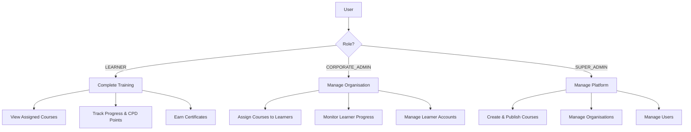
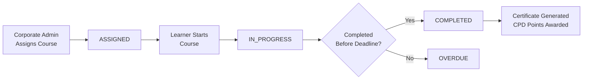

# Features Overview

Learnify Childcare is a corporate e-learning platform designed for early childhood education centres in Singapore. It supports three distinct user roles, each with purpose-built features for professional development management.

## Platform Highlights

### Purpose-Built for Childcare

- Courses cover childcare-specific topics: CPR, child development, nutrition, regulatory compliance
- CPD (Continuing Professional Development) points tracking aligned with Singapore's ECDA requirements
- Organisation-based structure mirrors how childcare centres actually operate
- Fixed pricing model (SGD 60 per assignment) removes pricing complexity

### SCORM-Compatible Progress Tracking

- Industry-standard SCORM 2.0 progress data stored per enrollment and per lecture
- Tracks lesson status, score, total time, suspend data, and lesson location
- Enables interoperability with existing LMS content and reporting standards

### Corporate Assignment Workflow

- Corporate admins assign courses directly to learners (no self-enrollment marketplace)
- Deadlines ensure timely completion of mandatory training
- Assignment statuses track the full lifecycle: Assigned, In Progress, Completed, Overdue
- Optional Stripe billing per assignment for organisations with billing enabled

## Role-Based Access



## Key Features by Role

=== "Learners"

    Childcare workers (teachers, assistants, support staff) who complete assigned training courses.

    - :material-view-dashboard: Personal dashboard with assigned courses and upcoming deadlines
    - :material-book-open: Complete assigned courses with video, text, and quiz content
    - :material-chart-line: Track learning progress with SCORM-compatible data
    - :material-star-circle: Earn CPD points upon course completion
    - :material-certificate: Download completion certificates with organisation name and CPD points
    - :material-account: Manage account settings (name, job title, profile image)

=== "Corporate Admins"

    Centre managers or training coordinators who manage their organisation's learning programme.

    - :material-account-group: View and manage learners within their organisation
    - :material-clipboard-check: Assign courses to individual learners with optional deadlines
    - :material-chart-bar: Monitor learner progress and completion rates
    - :material-view-dashboard: Organisation dashboard with key metrics
    - :material-credit-card: Optional Stripe billing for course assignments (SGD 60 per assignment)
    - :material-file-chart: Track assignment statuses across the organisation

=== "Super Admins"

    Platform administrators who manage the entire Learnify Childcare system.

    - :material-book-plus: Create courses with sections, lectures (video, text, quiz), and CPD points
    - :material-publish: Publish and manage course lifecycle (Draft, Published, Archived)
    - :material-domain: Manage organisations (create, edit, configure billing, set learner limits)
    - :material-account-multiple: Manage all users across all organisations
    - :material-folder: Manage course categories
    - :material-view-dashboard: Platform-wide dashboard and oversight

## Architecture

```
+---------------------------------------------------------------+
|                         Frontend                              |
|  +-------------+  +-------------+  +-------------------------+|
|  |   Next.js   |  |  React 19   |  |  Tailwind + shadcn/ui  ||
|  |  App Router |  |   Client    |  |      Components        ||
|  +-------------+  +-------------+  +-------------------------+|
+---------------------------------------------------------------+
                              |
                              v
+---------------------------------------------------------------+
|                         Backend                               |
|  +-------------+  +-------------+  +-------------------------+|
|  |  API Routes |  |  NextAuth   |  |   Server Components     ||
|  |   (REST)    |  |    v5       |  |   (Data Fetching)       ||
|  +-------------+  +-------------+  +-------------------------+|
+---------------------------------------------------------------+
                              |
                              v
+---------------------------------------------------------------+
|                      Data Layer                               |
|  +-------------+  +-------------+  +-------------------------+|
|  |   Prisma    |  | PostgreSQL  |  |      Cloudinary         ||
|  |     ORM     |  |   (Neon)    |  |   (Media Storage)       ||
|  +-------------+  +-------------+  +-------------------------+|
+---------------------------------------------------------------+
                              |
                              v
+---------------------------------------------------------------+
|                  External Services                            |
|  +-------------------------+  +-------------------------------+|
|  |   Stripe (Optional)     |  |   SCORM Data Persistence     ||
|  |   Course Assignment     |  |   (Progress Tracking)        ||
|  |   Billing               |  |                              ||
|  +-------------------------+  +-------------------------------+|
+---------------------------------------------------------------+
```

### Data Flow

```
Learner -> Dashboard -> Assigned Courses -> Lecture Viewer -> Progress API -> SCORM Data Storage

Corporate Admin -> Org Dashboard -> Assign Course -> Learner + Deadline -> Monitor Progress

Super Admin -> Admin Dashboard -> Create Course -> Sections/Lectures -> Publish
                               -> Create Organisation -> Add Users
```

## Security Features

- :material-lock: Secure authentication with NextAuth.js v5 (Credentials + OAuth providers)
- :material-shield: Role-based access control enforced at middleware, API, and component levels
- :material-key: JWT session management with role claims
- :material-domain: Organisation-scoped data isolation (corporate admins only see their own centre's data)
- :material-database-lock: Secure database connections with SSL (Neon PostgreSQL)
- :material-credit-card: PCI-compliant payments via Stripe (when billing is enabled)

## Course Assignment Lifecycle



## Pricing Model

Unlike marketplace platforms with variable pricing, Learnify Childcare uses a straightforward corporate pricing model:

- **Fixed price:** SGD 60 per course assignment
- **Billing is per-organisation:** Each organisation can have billing enabled or disabled
- **No billing required:** Organisations without billing enabled can still assign courses (useful for pre-paid contracts or subsidised training)
- **Stripe integration:** When billing is enabled, a Stripe Checkout session is created for each assignment
