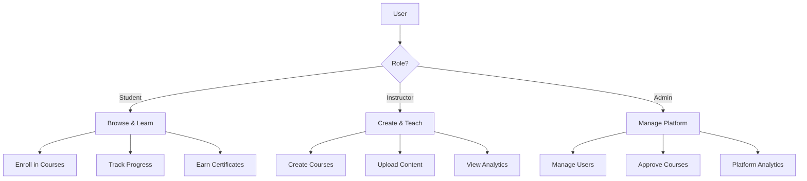

# Features Overview

Learnify is a comprehensive online learning platform with features for students, instructors, and administrators.

## Platform Highlights

### Modern Tech Stack

- **Next.js 15** with App Router for optimal performance
- **TypeScript** for type safety
- **Tailwind CSS** + **shadcn/ui** for beautiful UI
- **Prisma** ORM with **PostgreSQL**
- **Stripe** for secure payments
- **Cloudinary** for media management

### Role-Based Access



### Key Features by Role

=== "Students"

    - :material-magnify: Browse and search courses
    - :material-cart: Purchase courses with Stripe
    - :material-play-circle: Watch video lectures
    - :material-chart-line: Track learning progress
    - :material-star: Leave reviews and ratings
    - :material-heart: Manage wishlist
    - :material-certificate: Earn certificates

=== "Instructors"

    - :material-plus-circle: Create multimedia courses
    - :material-upload: Upload videos to Cloudinary
    - :material-currency-usd: Set course pricing
    - :material-chart-bar: View analytics dashboard
    - :material-cash: Track earnings
    - :material-account-group: Monitor student engagement

=== "Administrators"

    - :material-chart-areaspline: Platform-wide analytics
    - :material-account-multiple: User management
    - :material-check-circle: Course approval workflow
    - :material-folder: Category management
    - :material-cash-register: Revenue tracking

## Architecture

```
┌─────────────────────────────────────────────────────────────────┐
│                         Frontend                                 │
│  ┌─────────────┐  ┌─────────────┐  ┌─────────────────────────┐  │
│  │   Next.js   │  │  React 19   │  │  Tailwind + shadcn/ui   │  │
│  │  App Router │  │   Client    │  │      Components         │  │
│  └─────────────┘  └─────────────┘  └─────────────────────────┘  │
└─────────────────────────────────────────────────────────────────┘
                              │
                              ▼
┌─────────────────────────────────────────────────────────────────┐
│                         Backend                                  │
│  ┌─────────────┐  ┌─────────────┐  ┌─────────────────────────┐  │
│  │  API Routes │  │  NextAuth   │  │   Server Actions        │  │
│  │   (REST)    │  │    v5       │  │   (Mutations)           │  │
│  └─────────────┘  └─────────────┘  └─────────────────────────┘  │
└─────────────────────────────────────────────────────────────────┘
                              │
                              ▼
┌─────────────────────────────────────────────────────────────────┐
│                      Data Layer                                  │
│  ┌─────────────┐  ┌─────────────┐  ┌─────────────────────────┐  │
│  │   Prisma    │  │ PostgreSQL  │  │      Cloudinary         │  │
│  │     ORM     │  │   (Neon)    │  │   (Media Storage)       │  │
│  └─────────────┘  └─────────────┘  └─────────────────────────┘  │
└─────────────────────────────────────────────────────────────────┘
```

## Security Features

- :material-lock: Secure authentication with NextAuth.js
- :material-shield: Role-based access control
- :material-key: JWT session management
- :material-credit-card: PCI-compliant payments via Stripe
- :material-database-lock: Secure database connections with SSL
