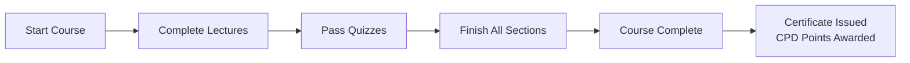

# Learner Features

Learnify Childcare provides a focused learning experience for early childhood educators. Learners are childcare workers -- teachers, teaching assistants, and support staff -- who complete courses assigned to them by their organisation's corporate admin.

## Learner Dashboard

The learner dashboard at `/dashboard` is the central hub for all learning activity. It provides:

- **Assigned courses** with deadlines and current progress
- **Upcoming deadlines** highlighted for time-sensitive training
- **Quick resume** links to continue where you left off
- **CPD points summary** showing total points earned
- **Recent completions** and certificates earned

## Assigned Courses

Unlike marketplace platforms where learners browse and purchase courses, Learnify Childcare uses an assignment model:

1. A **Corporate Admin** assigns a course to the learner, optionally with a deadline
2. The learner sees the assignment on their dashboard and in `/my-courses`
3. The assignment status tracks the lifecycle: **Assigned** -> **In Progress** -> **Completed** (or **Overdue** if the deadline passes)

### My Courses (`/my-courses`)

The my courses page shows all enrolled and assigned courses with:

- Course title and category
- Progress percentage bar
- Assignment deadline (if set)
- Assignment status badge (Assigned, In Progress, Completed, Overdue)
- Continue learning button
- Link to course overview

### Course Overview (`/my-courses/[courseId]`)

Each course overview page displays:

- Course title, description, and category
- Learning outcomes
- Estimated hours and CPD points available
- Section and lecture breakdown
- Current progress through the course
- Continue from last lecture button

## Learning Experience

### Lecture Viewer (`/my-courses/[courseId]/lectures/[lectureId]`)

The lecture viewer supports three content types:

**Video Lectures**

- Seamless video playback powered by Cloudinary CDN
- Progress tracking -- resume from where you left off
- Video position saved automatically via the progress API
- Watched duration tracked for SCORM compliance

**Text Content**

- Rich formatted text content (headings, lists, bold, italic)
- Scrollable reading pane with clear typography

**Quizzes**

- Multiple choice and multiple select questions
- Automatic grading with score display
- Open-ended questions (not auto-graded)
- Retry support with configurable passing scores
- Quiz scores tracked in SCORM data

### Progress Tracking

Progress is tracked at multiple levels:

- **Lecture-level:** Each lecture tracks completion status, watched duration, and last position
- **Course-level:** Overall enrollment progress is a percentage (0-100%) computed from completed lectures
- **SCORM-level:** Standards-compliant data including lesson status, score, total time, and suspend data

Learners can:

- See overall course completion percentage on the my courses page
- Track individual lecture completion within the course
- Resume video lectures from the exact position where they left off
- View which lectures remain incomplete

### SCORM Compatibility

Enrollment and lecture progress records include SCORM 2.0 fields:

| Field | Level | Description |
|-------|-------|-------------|
| `scormStatus` | Enrollment | Overall course status (e.g., "not attempted", "incomplete", "completed") |
| `scormScore` | Enrollment | Aggregate course score |
| `scormTotalTime` | Enrollment | Total time spent on the course |
| `scormSuspendData` | Enrollment | Serialised state for resuming |
| `scormLessonStatus` | Lecture | Per-lecture completion status |
| `scormSessionTime` | Lecture | Time spent in the current session |
| `scormLessonLocation` | Lecture | Bookmark for resuming within a lecture |
| `scormSuspendData` | Lecture | Per-lecture serialised state |

## CPD Points

Courses in Learnify Childcare carry CPD (Continuing Professional Development) points, which are important for professional registration and career advancement in Singapore's early childhood sector.

- Each course has a defined number of CPD points (set by the Super Admin)
- CPD points are awarded upon course completion (100% progress)
- The learner dashboard shows a running total of CPD points earned
- Certificates include the CPD points value

## Certificates

Certificates are generated automatically when a learner completes a course (progress reaches 100%).

### Certificate Details

Each certificate includes:

- **Unique certificate ID** for verification
- **Learner name** as registered on the platform
- **Course name** of the completed training
- **Organisation name** of the learner's childcare centre
- **CPD points** awarded for the course
- **Issue date** when the certificate was generated
- **Expiry date** (if applicable, for time-limited certifications)

### Certificate Management (`/certificates`)

The certificates page allows learners to:

- View all earned certificates in a list
- See certificate details (course, organisation, CPD points, dates)
- Download certificates for record-keeping
- Share certificates with their organisation

## Account Settings

The account page at `/account` allows learners to manage their profile:

- **Name** -- Display name used across the platform and on certificates
- **Job title** -- Role at the childcare centre (e.g., "Lead Teacher", "Centre Assistant")
- **Profile image** -- Upload via Cloudinary
- **Staff ID** -- Organisation-issued staff identifier (read-only, set by corporate admin)
- **Organisation** -- The childcare centre the learner belongs to (read-only)
