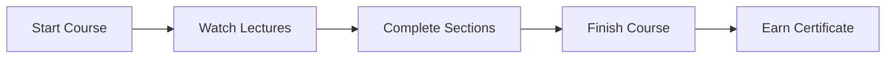

# Student Features

Learnify provides a comprehensive learning experience for students.

## Course Discovery

### Browse Courses

Students can browse all available courses with powerful filtering options:

- **Category Filter** - Filter by course category
- **Level Filter** - Beginner, Intermediate, Advanced
- **Price Filter** - Free and paid courses
- **Search** - Full-text search across course titles and descriptions

### Course Details

Each course page includes:

- Course description and objectives
- Instructor information
- Course curriculum (sections and lectures)
- Student reviews and ratings
- Price and enrollment button

## Learning Experience

### Video Player

- Seamless video playback powered by Cloudinary
- Progress tracking - resume where you left off
- Keyboard shortcuts for navigation

### Progress Tracking

Students can:

- See overall course completion percentage
- Track individual lecture completion
- Resume from last watched lecture
- View learning history

## Course Management

### My Courses

The student dashboard shows:

- Enrolled courses with progress
- Continue learning buttons
- Completion certificates

### Wishlist

- Save courses for later
- Get notified of price changes
- Quick enroll from wishlist

## Reviews & Ratings

After completing a course, students can:

- Leave a star rating (1-5)
- Write a detailed review
- Help other students choose courses

## Certificates

Upon course completion, students receive:

- Digital completion certificate
- Shareable on LinkedIn
- Unique verification code
